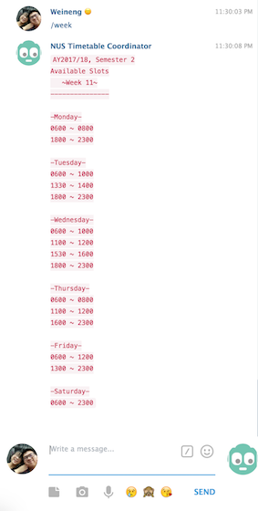

# NUS Timetable Coordinator

**Bot token:** 539235421:AAFXpGcd7FUoXowUt6vqC6zbZ3CqrSvhTXA

**bot_username:** nus_timetable_bot

## Description

This bot allow groups to add their timetable to the chat. The chatbot will then inform groups of timings where members are mutually available.

Try now by going to https://nusmods.com and get your URL from Share/Sync. In the telegram bot, type /add <URL> into the chat box. You may add as many timetables as you like, and type `/list` to see the timings where all time-tables are available

All commands that are available for this chatbot are listed below:

`/add` - Allows user to add modules.

`/list` - Check what are the current url added to the group.

`/week` - Returns a schedule of input week that indicates when all members are available.

`/del` - Allows user to delete modules.

`/clear` - Delete all timetable added

`/getweek` - Returns the week number of the semester

`/start` - Simple text to inform users of the bot functionalities.

Bot is currently hosted on a 1024 MB Server running on Ubuntu 18.04. There's funds to last 2.5 months, which will hopefully last until splashdown. 

# Nice Pictures

## Bugs/Issues and possible features

- `/check` command to allow users to see who added the timetable (Dictionary?)
- Keep poking to check corner cases
- Exception handling to ensure that program does not terminate on error.
- Prevent adding of repeated timetables.
- Refactor bot_main.py to use OOP for commands. This should reduce clutters in the code, making it unreadable currently.
- Current week used for /week is currently hard-coded. To scrap from NUSMods to get week number.
- Module details are currently downloaded into a huge 42mb file for every semester. To use NUSMods API to get HTTP request for latest JSON file for each module queried.
- To remove telegram bot token from readme once orbital ended. We can't be bothered to gitignore it. :)
- Code only works for AY2017/18, Semester 2. To use NUSMods to allow bot to work for all semesters.

## Credits

Made by: 

- [Ang Wei Neng](weineng.io) 
- Peh Yu Xiang

Special thanks to:

- Li Pengcheng (Mentor)
- The NUS Orbital team for the opportunity to build our app for credits

- [Gareth Dwyer](https://www.codementor.io/garethdwyer/building-a-telegram-bot-using-python-part-1-goi5fncay) for the tutorial on how to make a simple telegram bot.
